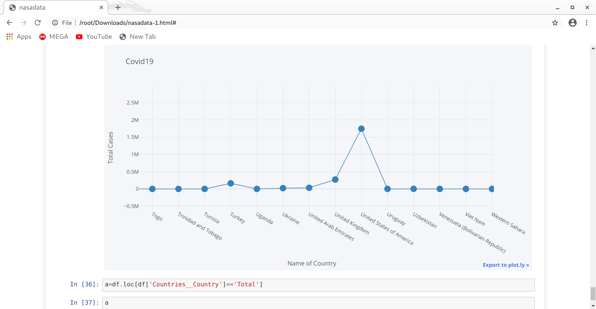
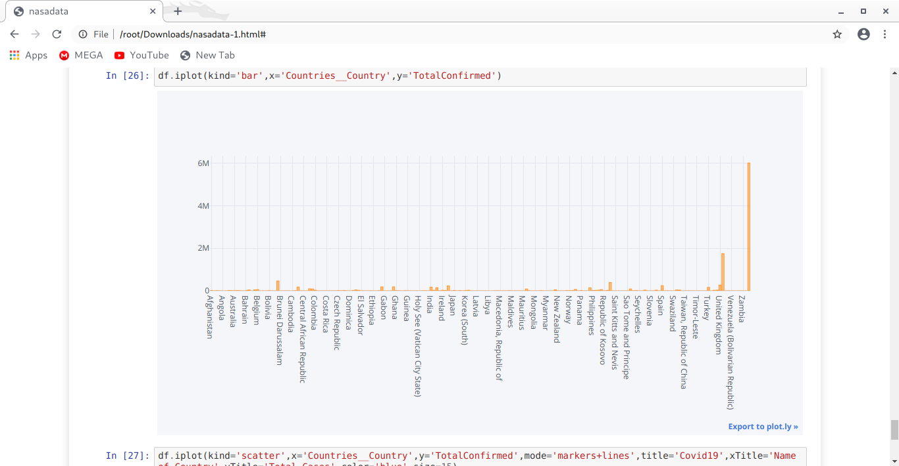
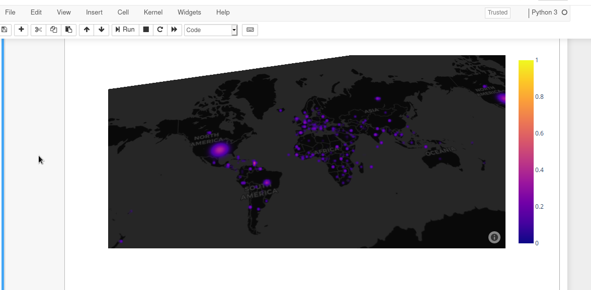

We are NepGlory, a team registered for NASA Spaceapps covid-19 hackathon 2020. With few resources but strong determination and a hive of creativity, we have managed to create some data visualitation with python assisted by the data provided from NASA.

Here are some of the pictures that briefly illustrates the things we have done.
PS: we will also upload our codes for judges to see

Also we have registered the site https://nepglory.co/index.html which will be updated with the things we have managed to create

1,

2,

3,

